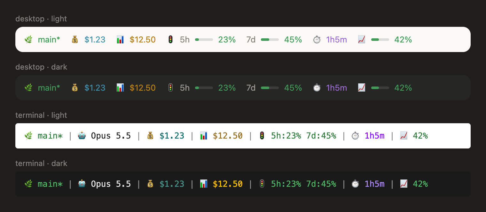

# ShellTime Claude Code mods

[Claude Code](https://claude.com/claude-code) mods by [ShellTime](https://shelltime.xyz).

A mod is a Claude Code plugin made of function hooks: a small TypeScript module that can draw its own UI, such as a band above the prompt, a pane or a status entry, and react to the session. Mods run in the terminal and in the Code tab of the Claude desktop app.

| Mod | What it does |
| --- | --- |
| [`shelltime-statusline`](plugins/shelltime-statusline) | The ShellTime statusline (git, model, session and daily cost, quota, agent time, context) above the prompt, in the terminal and the desktop app. Also links PRs opened with `gh pr create` to the session on shelltime.xyz |

## What you get



`shelltime-statusline` draws one line above the prompt. In the desktop app it is a flat row with small bars beside the percentages. In the terminal it is the same line as `shelltime cc statusline`. Both follow Claude Code's light or dark theme.

From left to right:

- 🌿 the git branch, with `*` when the tree is dirty
- 🤖 the model (terminal only; the desktop composer already shows it)
- 💰 this session's cost
- 📊 today's Claude Code cost
- 🚦 the 5-hour and 7-day quota used
- ⏱️ today's AI agent time
- 📈 the context window used

Quota and context turn yellow from 50% and red from 80%. The costs, quota and agent time are links to the session on shelltime.xyz, your coding agent page, claude.ai usage and your profile.

Before you run `shelltime init`, it still shows git, model, session cost, quota and context. Daily cost and agent time show `-`, and nothing is sent to ShellTime. The line refreshes as the conversation moves on, not while the session is idle.

When Claude opens a pull request with `gh pr create`, the mod links that PR to the session on shelltime.xyz. This goes through the `shelltime` CLI and its daemon.

The [mod's README](plugins/shelltime-statusline/README.md) has every segment's colors and where each number comes from.

## Install

```sh
claude plugin marketplace add shelltime/claude-code-mods
claude plugin install shelltime-statusline@shelltime
```

Or from inside Claude Code: `/plugin marketplace add shelltime/claude-code-mods`, then `/plugin install shelltime-statusline@shelltime`.

The mods read the ShellTime CLI's config (`~/.shelltime/config.*`). Run `shelltime init` once to sign in.

## Update

```sh
claude plugin marketplace update shelltime
claude plugin update shelltime-statusline@shelltime
```

The first command fetches the latest release from GitHub, the second installs it. Restart Claude Code to load it. The desktop app's Code tab uses the same plugins as the terminal, so one update covers both: quit the app (⌘Q) and open it again.

## Develop

```sh
# check the manifest and what the module hooks and calls
claude plugin validate plugins/shelltime-statusline

# run the tests
claude plugin test plugins/shelltime-statusline

# try it in a session; edits hot-reload
claude --plugin-dir plugins/shelltime-statusline
```

The engine writes the API types beside a loaded mod in `.claude-plugin/types/`, along with a `tsconfig.json`, so `tsc -p plugins/shelltime-statusline` type-checks it.

### UI preview and tests

The mods' UI can be previewed in [Storybook](https://storybook.js.org) and tested with [Vitest](https://vitest.dev), outside Claude Code. The tooling lives at the repo root, so installed plugins ship none of it.

```sh
pnpm install

# every surface in light and dark, at http://localhost:6006
pnpm storybook

# the drawings' trees, and every story rendered
pnpm test
pnpm typecheck
```

`tooling/engine` stands in for the engine. It provides the JSX runtime (`h`) and the element tables, which produce the same plain-data trees the engine checks, plus an approximate paint of those trees for Storybook. The preview is close to the real thing, not identical: `claude plugin test` stays the check of what the engine accepts. Stories are in `stories/`, specs in `tests/`.

## Release

Commits follow [Conventional Commits](https://www.conventionalcommits.org). On `main`, [release-please](https://github.com/googleapis/release-please) keeps a release PR open. Merging it tags `vX.Y.Z`, updates `CHANGELOG.md` and bumps the version in each mod's `plugin.json`, which is what tells installed copies to update.

When you add a mod, add its `.claude-plugin/plugin.json` to `extra-files` in `release-please-config.json`.

## License

MIT
